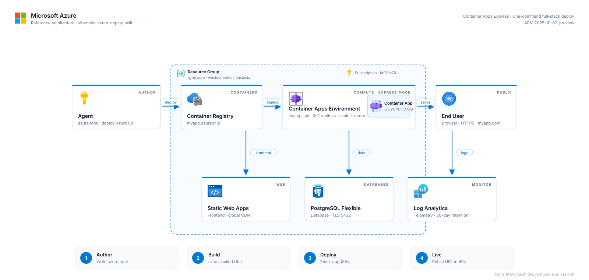

<div align="center">

# 🚀 vibecode-azure-deploy

**Ship full-stack apps to Azure with one command. Vercel-grade DX, powered by Azure Container Apps (Flex profile).**

[](LICENSE)
[](https://learn.microsoft.com/azure/container-apps/)
[](#status--roadmap)
[](CONTRIBUTING.md)
[](https://github.com/msftse)

</div>

---

## Why this exists

Vibe-coded apps need to ship the moment they work. Azure has the infrastructure to match what Vercel does — Static Web Apps for the frontend, Container Apps on the new **Flex** workload profile for the backend (per-second billing, sub-second cold starts), Postgres Flexible Server for data — but the developer experience gap has been brutal. Every shipped tutorial wants you to wire ARM templates, learn Bicep, or click through six portal blades. This skill closes that gap: one TOML file, one command, one URL out the other side.

## 🧭 Architecture



- **Developer** runs `deploy-azure up` after a one-time `init`.
- The **CLI** is a single stdlib-only Python script. No pip installs, no node_modules.
- For the Flex backend, the CLI talks directly to the **ARM REST API** (`Microsoft.App` provider, api-version `2025-10-02-preview`) because `az` hasn't shipped a friendly `--profile flex` flag yet.
- For everything else (ACR, Postgres, Static Web Apps, custom domains), it shells out to `az` — those CLI surfaces are stable.
- Provisioning is idempotent: every step is a GET-then-PUT. Re-running `up` is always safe.

## ⚡ Quickstart

```bash
git clone https://github.com/msftse/vibecode-azure-deploy-skill
cd vibecode-azure-deploy-skill/examples/hello-fullstack
../../skill/scripts/deploy-azure init
../../skill/scripts/deploy-azure up
# → https://your-app.westeurope.azurecontainerapps.io
```

Prereqs: `az` ≥ 2.85, Docker, Python 3.11+, an `az login` session (or service-principal env vars).

## 📦 What you get

| Feature                | vibecode-azure (Flex)             | Vercel                            |
| ---------------------- | --------------------------------- | --------------------------------- |
| One-command deploy     | ✅ `deploy-azure up`              | ✅ `vercel`                       |
| Bring-your-own Docker  | ✅ any container, any language    | ❌ Functions only                 |
| Long-running processes | ✅ no timeout                     | ❌ max 5 min (Pro)                |
| Per-second billing     | ✅ Flex                           | ❌ per-invocation                 |
| Scale-to-zero          | ⏳ preview unlock pending         | ✅                                |
| PR previews            | ⏳ on the roadmap                 | ✅                                |

Full table in [`docs/comparison-vercel.md`](docs/comparison-vercel.md).

## 🔧 The Flex breakthrough

Container Apps **Flex** is the new "Container Apps Express" workload profile: 0.25–32 vCPU, per-second billing, sub-second cold starts, GA on the ARM control plane under api-version `2025-10-02-preview`. The catch: `az` 2.85 doesn't yet expose it as a friendly flag.

Rather than wait for the CLI bits to ship, we PUT the ARM body directly:

```json
{
  "location": "westeurope",
  "properties": {
    "workloadProfiles": [
      { "name": "Flex", "workloadProfileType": "Flex" }
    ]
  }
}
```

That's the entire creation payload for a Flex managed environment. The container app itself is a second PUT against `Microsoft.App/containerApps` with `workloadProfileName: "Flex"`. See [`docs/how-it-works.md`](docs/how-it-works.md) and [`skill/references/arm-rest-patterns.md`](skill/references/arm-rest-patterns.md) for the full request bodies.

When `az` ships native Flex support, the script will switch transparently. The user-facing CLI doesn't change.

## 🧩 Install as a Hermes skill

```bash
hermes skills install https://github.com/msftse/vibecode-azure-deploy-skill
```

Or the manual path — clone and symlink:

```bash
git clone https://github.com/msftse/vibecode-azure-deploy-skill ~/code/vibecode-azure-deploy-skill
mkdir -p ~/.hermes/skills/devops
ln -s ~/code/vibecode-azure-deploy-skill/skill ~/.hermes/skills/devops/deploy-azure
```

Either way, the `deploy-azure` CLI lives at `skill/scripts/deploy-azure`. Add that directory to your `PATH` or call it directly.

## 📜 Commands

| Command                          | Purpose                                                  |
| -------------------------------- | -------------------------------------------------------- |
| `deploy-azure init`              | Scan the cwd, write `azure.toml`.                        |
| `deploy-azure up`                | Idempotent build/push/provision. `--profile flex` default.|
| `deploy-azure db add postgres`   | Provision a Postgres Flexible Server.                    |
| `deploy-azure domain add <host>` | Bind a custom domain (frontend or backend).              |
| `deploy-azure logs --tail`       | Stream backend container logs.                           |
| `deploy-azure status`            | Show URLs + resource table.                              |
| `deploy-azure destroy`           | Delete the resource group.                               |

## 🗺 Status & Roadmap

- [x] Flex workload profile via ARM REST
- [x] Static Web Apps frontend
- [x] Postgres Flexible Server
- [x] Custom domains
- [ ] Scale-to-zero on Flex (waiting on Microsoft preview unlock)
- [ ] `az` CLI native `--profile flex` flag (will switch when it lands)
- [ ] PR preview deployments
- [ ] GPU containers (Consumption-GPU profile)

## ❓ FAQ

**How much does this cost?**
A small idle Flex backend (0.5 vCPU / 2Gi, minReplicas=1) runs about **$13/month** at westeurope list prices. SWA Free tier is $0. Postgres B1ms is $13/month. Total: ~$26/month for a fully production-shaped vibe project. Subsequent traffic adds per-second compute on top.

**Which regions are supported?**
Flex is confirmed working in **westeurope**, **eastus**, and **eastus2**. Microsoft is expanding the list; the script will warn but not block other regions.

**Why not just use `az containerapp up`?**
`az containerapp up` is great for the Consumption profile and works fine — `deploy-azure up --profile consumption` actually shells out to it. But it doesn't speak Flex yet, and we also wanted one command that wires Static Web Apps + Postgres + custom domain. That's the gap.

**How do I migrate off this later?**
Everything provisioned is standard ARM. Your image is a normal OCI artifact in a normal ACR. You can `az containerapp show ... -o yaml > app.yaml`, take it to Bicep / Terraform, and never look back. No lock-in.

**Is this official Microsoft?**
**No.** This is a community-built skill by [@msftse](https://github.com/msftse) (a Microsoft STU in Israel). The Azure team isn't behind it. It happens to use only documented, supported Azure APIs.

## 🙏 Acknowledgments

Credit to the Microsoft Azure Container Apps team for shipping the Flex workload profile and exposing it cleanly on ARM, even before the CLI caught up. That's what made this skill possible at all.

This project is community-built and unaffiliated with Microsoft. "Azure", "Container Apps", and "Static Web Apps" are trademarks of Microsoft Corporation.

## 📄 License

MIT. See [LICENSE](LICENSE).
